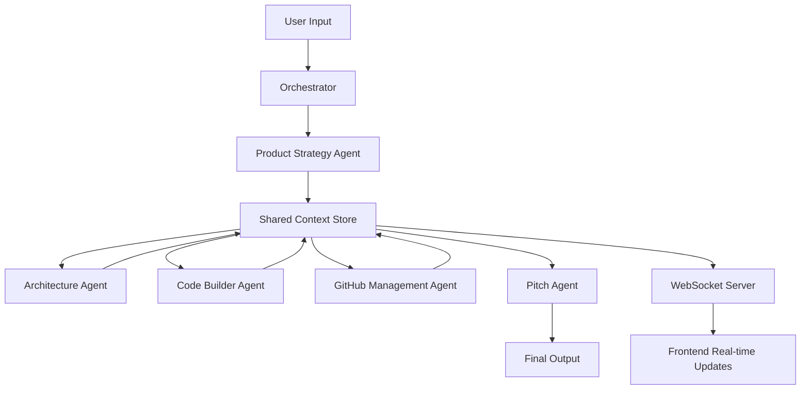

# OrkestrAI - Multi-Agent Architecture Plan

## 1. Multi-Agent Workflow Design

### Agent Pipeline Flow

```
User Input (Project Idea)
    ↓
[Product Strategy Agent]
    ↓ (Requirements, Features, MVP Scope)
[Architecture Agent]
    ↓ (Tech Stack, System Design, API Structure)
[Code Builder Agent]
    ↓ (Generated Code, Project Structure)
[GitHub Management Agent]
    ↓ (Issues, Sprints, Workflow)
[Pitch & Demo Agent]
    ↓
Final Deliverables
```

### Agent Definitions

#### 1. Product Strategy Agent
**Role**: Product Manager & Business Analyst
**Goal**: Transform vague ideas into structured product requirements
**Backstory**: Expert product strategist with 10+ years in startup MVPs

**Responsibilities**:
- Parse user input and extract core problem
- Identify target users and use cases
- Define MVP features with priority levels
- Create user stories and acceptance criteria
- Generate product roadmap with milestones
- Output structured JSON for next agents

**Tools**:
- `idea_analyzer`: Extracts key concepts from user input
- `feature_prioritizer`: Ranks features by impact/effort
- `user_story_generator`: Creates detailed user stories

**Output Format**:
```json
{
  "project_name": "string",
  "problem_statement": "string",
  "target_users": ["string"],
  "core_features": [
    {
      "name": "string",
      "priority": "high|medium|low",
      "user_story": "string",
      "acceptance_criteria": ["string"]
    }
  ],
  "mvp_scope": ["string"],
  "tech_constraints": ["string"]
}
```

#### 2. Architecture & Design Agent
**Role**: Senior Software Architect
**Goal**: Design scalable, production-ready system architecture
**Backstory**: Full-stack architect specializing in rapid prototyping

**Responsibilities**:
- Analyze product requirements from Strategy Agent
- Recommend optimal tech stack
- Design database schema with relationships
- Create API endpoint structure
- Design frontend component hierarchy
- Generate architecture diagrams
- Define data flow and state management

**Tools**:
- `tech_stack_recommender`: Suggests best technologies
- `schema_designer`: Creates database models
- `api_planner`: Designs RESTful endpoints
- `architecture_visualizer`: Generates Mermaid diagrams

**Output Format**:
```json
{
  "tech_stack": {
    "frontend": ["Next.js", "Tailwind CSS", "Zustand"],
    "backend": ["FastAPI", "SQLAlchemy"],
    "database": "PostgreSQL",
    "deployment": ["Vercel", "Railway"]
  },
  "database_schema": {
    "tables": [
      {
        "name": "string",
        "fields": [{"name": "string", "type": "string", "constraints": "string"}],
        "relationships": ["string"]
      }
    ]
  },
  "api_endpoints": [
    {
      "method": "GET|POST|PUT|DELETE",
      "path": "/api/v1/resource",
      "description": "string",
      "request_body": {},
      "response": {}
    }
  ],
  "frontend_structure": {
    "pages": ["string"],
    "components": ["string"],
    "state_management": "string"
  }
}
```

#### 3. Code Builder Agent
**Role**: Senior Full-Stack Developer
**Goal**: Generate production-quality starter code
**Backstory**: Expert coder with experience in rapid prototyping

**Responsibilities**:
- Generate project scaffolding
- Create backend API routes with FastAPI
- Build frontend components with Next.js
- Implement database models
- Add authentication boilerplate
- Generate configuration files
- Create Docker setup
- Add basic tests

**Tools**:
- `code_generator`: Creates files from templates
- `boilerplate_creator`: Generates project structure
- `dependency_manager`: Creates package.json/requirements.txt

**Output Format**:
```json
{
  "generated_files": [
    {
      "path": "string",
      "content": "string",
      "language": "string"
    }
  ],
  "setup_instructions": ["string"],
  "dependencies": {
    "frontend": ["string"],
    "backend": ["string"]
  }
}
```

#### 4. GitHub Management Agent
**Role**: DevOps & Project Manager
**Goal**: Automate GitHub workflow and project management
**Backstory**: Agile coach specializing in developer productivity

**Responsibilities**:
- Create GitHub repository structure
- Generate issues from features
- Create sprint milestones
- Suggest commit message structure
- Generate PR templates
- Create project board with columns
- Add CI/CD workflow suggestions

**Tools**:
- `github_api_client`: Interacts with GitHub API
- `issue_generator`: Creates detailed issues
- `sprint_planner`: Organizes tasks into sprints

**Output Format**:
```json
{
  "repository": {
    "name": "string",
    "description": "string",
    "topics": ["string"]
  },
  "issues": [
    {
      "title": "string",
      "body": "string",
      "labels": ["string"],
      "milestone": "string",
      "assignees": ["string"]
    }
  ],
  "milestones": [
    {
      "title": "Sprint 1",
      "description": "string",
      "due_date": "string"
    }
  ],
  "project_board": {
    "columns": ["Backlog", "In Progress", "Review", "Done"],
    "cards": ["string"]
  }
}
```

#### 5. Pitch & Demo Agent
**Role**: Presentation Coach & Marketing Strategist
**Goal**: Create compelling hackathon pitch materials
**Backstory**: Former startup founder who won multiple pitch competitions

**Responsibilities**:
- Generate elevator pitch (30 seconds)
- Create demo script with timing
- Suggest key talking points for judges
- Generate slide deck outline
- Create technical highlights list
- Suggest live demo flow
- Generate README with impact metrics

**Tools**:
- `pitch_generator`: Creates persuasive narratives
- `demo_scripter`: Designs presentation flow
- `impact_calculator`: Quantifies project value

**Output Format**:
```json
{
  "elevator_pitch": "string",
  "demo_script": [
    {
      "timestamp": "0:00-0:30",
      "action": "string",
      "talking_points": ["string"]
    }
  ],
  "judge_talking_points": {
    "technical_innovation": ["string"],
    "business_impact": ["string"],
    "scalability": ["string"]
  },
  "slide_outline": ["string"],
  "readme_sections": ["string"]
}
```

## 2. Agent Communication Architecture

### Communication Pattern: Sequential with Shared Context



### Shared Context Store Structure

```python
class SharedContext:
    """Central state management for agent communication"""
    
    def __init__(self):
        self.project_id: str
        self.user_input: str
        self.strategy_output: dict
        self.architecture_output: dict
        self.code_output: dict
        self.github_output: dict
        self.pitch_output: dict
        self.agent_logs: List[AgentLog]
        self.status: str  # "planning", "architecting", "coding", etc.
        
class AgentLog:
    """Track agent activity for visualization"""
    timestamp: datetime
    agent_name: str
    action: str
    status: str  # "thinking", "working", "completed"
    output_preview: str
    metadata: dict
```

### CrewAI Orchestration Flow

```python
from crewai import Crew, Agent, Task, Process

class OrkestrAICrew:
    def __init__(self, watsonx_llm):
        self.llm = watsonx_llm
        self.shared_context = SharedContext()
        
    def create_agents(self):
        # Define all 5 agents with roles, goals, backstories
        pass
        
    def create_tasks(self):
        # Sequential tasks with dependencies
        task1 = Task(
            description="Analyze project idea and create product strategy",
            agent=self.strategy_agent,
            expected_output="JSON with features and MVP scope"
        )
        # ... more tasks
        
    def run_orchestration(self, user_input: str):
        crew = Crew(
            agents=[...],
            tasks=[...],
            process=Process.sequential,  # Run agents in order
            verbose=True,
            memory=True  # Enable memory for context sharing
        )
        
        result = crew.kickoff(inputs={"user_input": user_input})
        return result
```

## 3. Real-Time Visualization System

### WebSocket Event Stream

```python
# Backend: FastAPI WebSocket endpoint
@app.websocket("/ws/orchestration/{project_id}")
async def orchestration_websocket(websocket: WebSocket, project_id: str):
    await websocket.accept()
    
    # Stream agent activity in real-time
    async for event in agent_event_stream(project_id):
        await websocket.send_json({
            "type": event.type,  # "agent_start", "agent_thinking", "agent_output"
            "agent": event.agent_name,
            "status": event.status,
            "message": event.message,
            "data": event.data,
            "timestamp": event.timestamp
        })
```

### Frontend Visualization Components

1. **Agent Avatar Panel**: Animated avatars showing which agent is active
2. **Activity Timeline**: Vertical timeline of agent handoffs
3. **Code Stream**: Live code generation with syntax highlighting
4. **Progress Tracker**: Visual progress bar through pipeline
5. **Output Preview**: Real-time preview of generated artifacts

## 4. Error Detection & Logging

### Error Monitoring Architecture

```python
class ErrorDetectionAgent:
    """Monitors agent outputs for issues"""
    
    def analyze_code_output(self, code: str) -> List[Issue]:
        # Static analysis
        # Syntax checking
        # Best practice validation
        pass
        
    def suggest_fixes(self, issues: List[Issue]) -> List[Fix]:
        # AI-powered fix suggestions
        pass
```

### Logging Strategy

```python
# Structured logging with context
import structlog

logger = structlog.get_logger()

logger.info(
    "agent_execution",
    agent="ProductStrategyAgent",
    project_id=project_id,
    status="completed",
    duration_ms=1234,
    output_size=5678
)
```

## 5. MVP Scope for 36-48 Hour Hackathon

### Must-Have Features (Core MVP)
1. ✅ Single project idea input form
2. ✅ 3 core agents: Strategy, Architecture, Code Builder
3. ✅ Real-time agent visualization (simplified)
4. ✅ Generated code download as ZIP
5. ✅ Basic project summary output
6. ✅ Simple, beautiful UI with Tailwind

### Nice-to-Have (If Time Permits)
1. 🎯 GitHub integration (issues only)
2. 🎯 Pitch generation
3. 🎯 Project history/saved projects
4. 🎯 Code syntax highlighting
5. 🎯 Export to GitHub directly

### Post-Hackathon Features
1. 📦 Full GitHub workflow automation
2. 📦 Error detection agent
3. 📦 Multi-project management
4. 📦 Team collaboration
5. 📦 Custom agent configuration

## 6. Judge-Impressing Features

### Technical Innovation
1. **Live Multi-Agent Orchestration**: Show agents "thinking" and collaborating
2. **Real-time Code Generation**: Stream code as it's being created
3. **IBM watsonx Integration**: Highlight enterprise AI usage
4. **Intelligent Architecture Design**: Show AI making smart tech decisions

### Visual Impact
1. **Animated Agent Avatars**: Each agent has personality
2. **Particle Effects**: Visual connections between agents
3. **Code Streaming Animation**: Matrix-style code generation
4. **Progress Visualization**: Beautiful progress indicators

### Business Value
1. **Time Savings**: "Reduces 8 hours of planning to 5 minutes"
2. **Quality**: "Production-ready code from day one"
3. **Accessibility**: "Makes hackathons accessible to non-technical founders"

### Demo Flow (3-5 minutes)
1. **Hook (30s)**: "We built an AI team that builds your hackathon project"
2. **Problem (30s)**: Show pain points of manual planning
3. **Solution (60s)**: Live demo - enter idea, watch agents work
4. **Results (60s)**: Show generated code, architecture, GitHub issues
5. **Impact (30s)**: Metrics and future vision
6. **Q&A (30s)**: Handle judge questions

## 7. Scalability & Future Expansion

### Phase 1: Post-Hackathon (Week 1-2)
- Add user authentication
- Implement project history
- Add more agent tools
- Improve error handling

### Phase 2: Beta Launch (Month 1-2)
- Multi-user collaboration
- Custom agent configuration
- Integration marketplace (Jira, Linear, etc.)
- Advanced code analysis

### Phase 3: Production (Month 3-6)
- Enterprise features
- White-label solution
- API for third-party integrations
- Agent marketplace (custom agents)

### Monetization Strategy
- **Free Tier**: 3 projects/month
- **Pro Tier**: $29/month - Unlimited projects, priority processing
- **Team Tier**: $99/month - Collaboration, custom agents
- **Enterprise**: Custom pricing - White-label, dedicated support