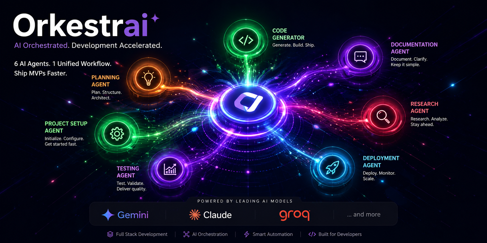

<div align="center">
  <h1>🚀 OrkestrAI</h1>
  
  

  <h3><em>Empowering Hackathons through Autonomous Multi-Agent Orchestration</em></h3>

  [](https://nextjs.org/)
  [](https://fastapi.tiangolo.com/)
  [](https://www.postgresql.org/)
  [](https://python.org/)
</div>

---

## 🌟 About the Project

**OrkestrAI** is a cutting-edge, multi-agent AI platform designed to revolutionize the way hackathon projects are conceived, planned, and executed. Built specifically for the **IBM Hackathon**, OrkestrAI leverages an advanced custom orchestration engine to manage a team of specialized AI agents. They work in perfect harmony to transform a single spark of an idea into a comprehensive, pitch-ready project in under 2 minutes.

In the high-pressure environment of a hackathon, time is the most valuable currency. OrkestrAI collapses 8 hours of strategy, architecture design, and project scaffolding into just **90 seconds** of autonomous collaboration.

---

## 🤖 The 6-Agent Autonomous Squad

Our proprietary orchestration pipeline runs agents sequentially, backed by a robust `ProviderRouter` that handles LLM fallbacks (IBM watsonx, Groq, OpenRouter, Gemini, OpenAI) and circuit breaking for 99.9% uptime.

1. 🎯 **Strategic Visionary**: Crafts market analysis, product scope, and project roadmaps.
2. 🏗️ **System Architect**: Designs robust backend schemas, APIs, and frontend structures.
3. ⚡ **Lead Builder**: Generates production-ready boilerplate code and implementation guides.
4. 🔀 **GitHub Integrator**: Orchestrates repository setup, creates branches, and pushes code via the GitHub API.
5. ✨ **Pitch Maestro**: Compiles winning elevator pitches, demo scripts, and presentation materials.
6. 🔍 **Audit Controller**: A self-correcting QA loop that audits every agent's output, preventing hallucinations and enforcing retries when necessary.

---

## ⚙️ Tech Stack & Architecture

OrkestrAI is built with a modern, highly scalable two-tier architecture:

* **Frontend:** Next.js 16 (App Router), React 19, Tailwind CSS v4, Zustand, Framer Motion.
* **Backend:** FastAPI (Async), PostgreSQL, SQLAlchemy 2.0, Alembic.
* **Real-Time Engine:** Custom WebSocket manager for streaming live agent execution logs to the cyberpunk dashboard.

---

## 🚀 Quick Start Guide

Want to run OrkestrAI locally? Follow these steps:

### Prerequisites
* Python 3.11+
* Node.js 18+
* PostgreSQL 14+

### 1. Database & Backend Setup
```bash
# Clone the repository
git clone https://github.com/grsanudeep42-cmd/Orkestrai.git
cd Orkestrai/backend

# Install dependencies
pip install -r requirements.txt

# Configure environment variables (Add your DB URL and API Keys)
cp config.template .env

# Start the FastAPI server
uvicorn app.main:app --reload
```

### 2. Frontend Setup
```bash
# In a new terminal, navigate to the frontend
cd Orkestrai/frontend

# Install dependencies
npm install

# Configure environment variables
cp config.template .env.local

# Start the Next.js development server
npm run dev
```

Visit `http://localhost:3000` to access the dashboard and start building!

---

## 👥 Meet the Team

Our diverse team of innovators brought OrkestrAI to life through a passion for AI and developer experience.

| Member | Role | GitHub |
| :--- | :--- | :--- |
| **Anudeep** | Full-stack & DevOps Engineer | [@grsanudeep42-cmd](https://github.com/grsanudeep42-cmd) |
| **Yogeswar** | Backend & AI/ML Engineer | [@yogeswar142](https://github.com/yogeswar142) |
| **Nagu** | Frontend & UI/UX Developer | [@Nagu-2508](https://github.com/Naagu-2508) |

---

<p align="center">
  <i>Built with ❤️ for the global hackathon community.</i><br>
  <b>Stop planning, start building with OrkestrAI! 🚀</b>
</p>
